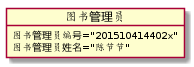

实验三：图书管理系统领域对象建模
================
|学号|班级|姓名|照片|
|:-:|:-:|:-:|:-:|
|201510414402|软工4班|陈节|无|

1.图书管理系统的类图
--------------
### 1.1 plantuml源码如下:
<pre>
@startuml
class 读者{
	String 读者编号
	String 读者姓名
	int 可借书量
	int 当前借书量
	查询图书()
	查询账户()
        预约图书()
}

class 图书管理员{
	String 图书管理员编号
	String 图书管理员姓名
	借出图书()
	归还图书()
        新增读者信息()
        修改读者信息()
        删除读者信息()
}

class 系统管理员{
	String 系统管理员编号
	Stirng 系统管理员姓名
	新增图书管理员信息()
        修改图书管理员信息()
        删除图书管理员信息()
        查看图书管理员信息()
}

class 图书信息{
	String 图书编号
	String 图书名
	String 作者
	String 出版社
	String 总量
	String 余量
}

class 借阅记录表{
	String 读者编号
	String 图书编号
	String 读者姓名
	String 图书名
	Date 借阅时间
	Date 归还时间
	String 操作员
}

class 预约表{
	String 读者编号
	String 图书编号
	String 读者姓名
	String 图书名
	Date 预约日期
	int 预约状态
}

class 读者信息表{
        String 读者编号
        String 读者姓名
        String 身份证号
        String 性别
        int 可借书量
        int 当前借书量
        Date 注册日期
        String 操作人
}

class 图书管理员信息表{
        String 图书管理员编号
        String 图书管理员姓名
        String 性别
        String 身份证号
        Date 注册日期
}
读者"N"--"1" 图书管理员
读者"1"--"1"读者信息表:查询账户
读者"1"--"N"预约表:预约图书
图书管理员 -- 图书管理员信息表
图书管理员"1"--"N"读者信息表:增删改读者信息
图书管理员"1"--"N"借阅记录表:借书/还书
系统管理员"1"--"N"图书管理员信息表:增删改查图书管理员信息
借阅记录表"1"--"1"图书信息
@enduml@enduml
</pre>

### 1.2 类图如下:

### 1.3 类图说明:

类图分为读者类、图书管理员类、系统管理员类、图书信息类、读者信息类、图书管理员信息类、系统管理员信息类、预约表类、借阅记录表类；
系统管理员只负责管理图书管理员，图书管理员负责处理图书库的增删改查以及处理读者的借阅等操作；

2.图书管理系统的对象图
-------
### 2.1 读者类
### 源码
<pre>
@startuml
object 读者{
	读者编号="201510414402"
    读者姓名="陈节"
	可借书量=5
	当前借书量=1
}
@enduml
</pre>

### 对象图

### 2.2 图书管理员类
### 源码
<pre>
@startuml
object 图书管理员{
	图书管理员编号="201510414402x"
	图书管理员姓名="陈节节"
}
@enduml
</pre>

### 对象图

### 2.3 系统管理员类
### 源码
<pre>
@startuml
object 系统管理员{
	系统管理员编号="201510414402s"
	系统管理员姓名="节节陈"
}
@enduml
</pre>

### 对象图

### 2.4 图书信息类
### 源码
<pre>
@startuml
object 图书信息{
	图书编号="123456789"
	图书名="信息系统分析与设计"
	作者="王晓敏"
	出版社="清华大学出版社"
	总量=10
	余量=10
}
@enduml
</pre>

### 对象图

### 2.5 借阅记录表
### 源码
<pre>
@startuml
object 借阅记录表{
	读者编号="201510414402"
	图书编号="123456798"
	读者姓名="陈节"
	图书名="C语言程序设计"
	借阅时间="20180417"
	归还时间=NULL
	操作人编号="201510414402s"
	操作人姓名="陈节节"
}
@enduml
</pre>

### 对象图

### 2.6 读者信息类
### 源码
<pre>
@startuml
object 读者信息{
	读者编号="201510414402"
        读者姓名="陈节"
	身份证号="510502199604023214"
	性别=1
	可借书量=5
	当前借书量=1
	注册日期="20180417"
	操作人编号="201510414402x"
	操作人姓名="陈节节"
}
@enduml
</pre>

### 对象图

### 2.7 图书管理员信息类
### 源码
<pre>
@startuml
object 图书管理员信息{
	图书管理员编号="201510414402x"
	图书管理员姓名="陈节节"
	性别=1
	身份证号="510502199604023216"
	注册日期="20180417"
}
@enduml
</pre>

### 对象图

### 2.8 预约类
### 源码
<pre>
@startuml
object 预约表{
	读者编号="201510414402"
	图书编号="123456789"
	读者姓名="陈节"
	图书名="信息系统分析与设计"
	预约日期="20180417"
	预约状态=1
}
@enduml
</pre>

### 对象图

