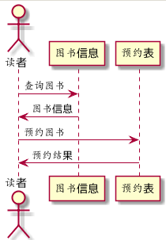
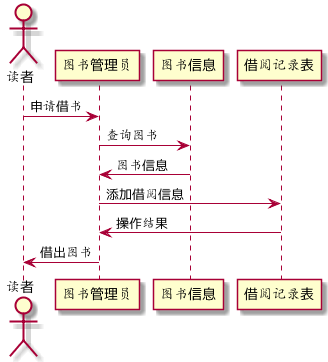
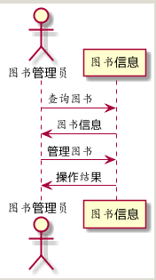
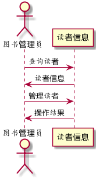
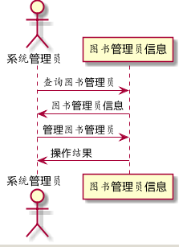

实验四：图书管理系统顺序图绘制
===============
|学号|班级|姓名|照片|
|:-:|:-:|:-:|:-:|
|201510414402|软工4班|陈节|无|

1.预约用例
------
### 1.1 plantuml源码如下:
<pre>
@startuml
actor 读者
读者 -> 图书信息: 查询图书
图书信息 -> 读者: 图书信息
读者 -> 预约表: 预约图书
预约表 -> 读者: 预约结果
@enduml
</pre>

### 1.2 顺序图如下:

2.借书用例
------
### 2.1 plantuml源码如下:
<pre>
@startuml
actor 读者
读者 -> 图书管理员: 申请借书
图书管理员 -> 图书信息: 查询图书
图书信息 -> 图书管理员: 图书信息
图书管理员 -> 借阅记录表: 添加借阅信息
借阅记录表 -> 图书管理员: 操作结果
图书管理员 -> 读者: 借出图书
@enduml
</pre>

### 2.2 顺序图如下:

3.还书用例
------
### 3.1 plantuml源码如下:
<pre>
@startuml
actor 读者
读者 -> 图书管理员: 申请还书
图书管理员 -> 借阅记录表: 修改借阅信息
借阅记录表 -> 图书管理员: 操作结果
图书管理员 -> 读者: 还书成功
@enduml
</pre>

### 3.2 顺序图如下:

4.管理图书用例
--------
### 4.1 plantuml源码如下:
<pre>
@startuml
actor 图书管理员
图书管理员 -> 图书信息: 查询图书
图书信息 -> 图书管理员: 图书信息
图书管理员 -> 图书信息: 管理图书
图书信息 -> 图书管理员: 操作结果
@enduml
</pre>

### 4.2 顺序图如下:

5.管理读者用例
--------
### 5.1 plantuml源码如下:
<pre>
@startuml
actor 图书管理员
图书管理员 -> 读者信息: 查询读者
读者信息 -> 图书管理员: 读者信息
图书管理员 -> 读者信息: 管理读者
读者信息 -> 图书管理员: 操作结果
@enduml
</pre>

### 5.2 顺序图如下:

6.管理图书管理员用例
-----------
### 6.1 plantuml源码如下:
<pre>
actor 系统管理员
系统管理员 -> 图书管理员信息: 查询图书管理员
图书管理员信息 -> 系统管理员: 图书管理员信息
系统管理员 -> 图书管理员信息: 管理图书管理员
图书管理员信息 -> 系统管理员: 操作结果
@enduml
</pre>

### 6.2 顺序图如下:

