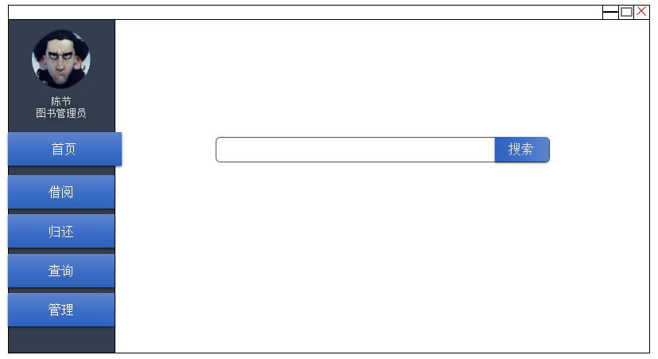
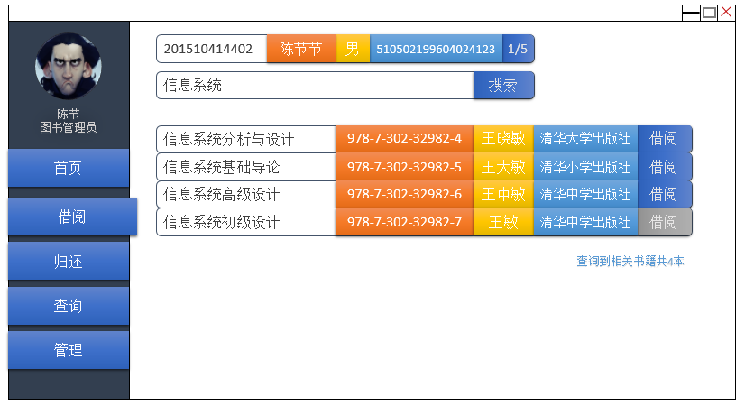
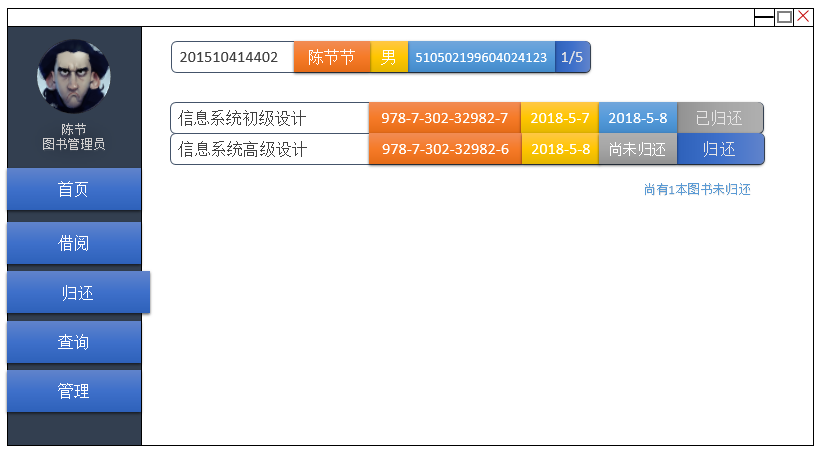

实验五：图书管理系统数据库设计与界面设计
=========================

|学号|班级|姓名|照片|
|:-:|:-:|:-:|:-:|
|201510414402|软工4班|陈节|无|

1.数据库表设计
--------
### 1.1 Reader表（读者表）:

|字段|类型|主/外键|可否为空|默认值|说明|
|:-:|:-:|:-:|:-:|:-:|:-:|
|reader_id|int(12)|主键|否||读者编号|
|reader_name|varchar(20)||否||读者姓名|
|availableNum|int(2)||否||可借书量|
|alreaderNum|int(2)||否||已借书量|
|IDCard|varchar(19)||否||身份证号|
|sex|varchar(2)||否||性别|
|singinDate|Date||否||注册日期|

### 1.2 Manager表（管理员表）:

|字段|类型|主/外键|可否为空|默认值|说明|
|:-:|:-:|:-:|:-:|:-:|:-:|
|manager_id|int(12)|主键|否||管理员编号|
|manager_name|varchar(20)||否||图书管理员姓名|
|manager_password|varchar(20)|否|root||管理员密码|
|IDCard|varchar(19)||否||身份证号|
|sex|varchar(2)||否||性别|
|authority|int(1)|否|||管理员类型，0为图书管理员，1为系统管理员|

### 1.3 BookInfo表（图书表）:

|字段|类型|主/外键|可否为空|默认值|说明|
|:-:|:-:|:-:|:-:|:-:|:-:|
|ISBN|varchar(18)|主键|否||图书编号|
|book_name|varchar(40)||否||图书名称|
|book_author|varchar(40)|否|||图书作者|
|book_publisher|varchar(20)|否|||图书出版社|
|allNum|int(3)|否|||图书总量|
|restNum|int(3)|否|||图书余量|

### 1.4 BorrowTable表（借阅记录表）:

|字段|类型|主/外键|可否为空|默认值|说明|
|:-:|:-:|:-:|:-:|:-:|:-:|
|reader_id|int(12)|主键|否||读者编号|
|ISBN|varchar(18)|主键|否||图书编号|
|borrowDate|Date||否||借书日期|
|returnDate|Date||是||归还日期|
|operator_id|int(12)||否||操作人编号,即图书管理员编号|

### 1.5 Order表（预约表）:

|字段|类型|主/外键|可否为空|默认值|说明|
|:-:|:-:|:-:|:-:|:-:|:-:|
|reader_id|int(12)|主键|否||读者编号|
|ISBN|varchar(18)|主键|否||图书编号|
|orderDate|Date||否||预约日期|
|state|int(2)||否||预约状态，0为预约失败，1为预约成功，2为暂未处理|

2.界面设计
------

(1)首页

(2)借书界面

(3)还书界面
