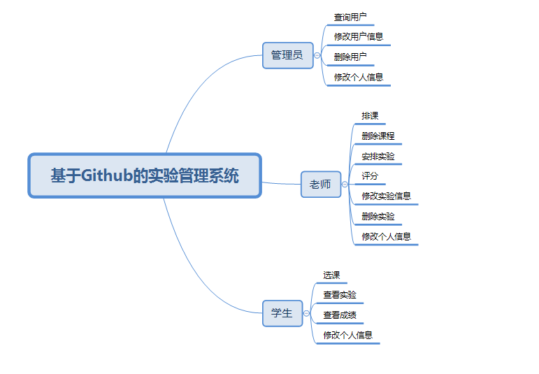
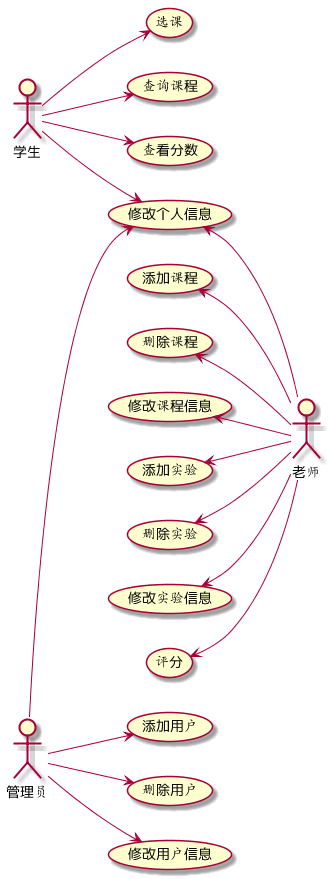
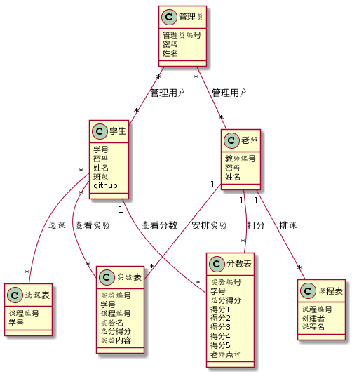

实验六：基于GITHUB的实验管理系统
=========================

|学号|班级|姓名|照片|
|:-:|:-:|:-:|:-:|
|201510414402|软工4班|陈节|无|

## 1.概述
- 基于GitHub的实验管理系统的作用是在线管理实验成绩的Web应用系统。

- 系统流程描述：管理员首先录入用户信息（包括老师和学生），然后给老师排课并创建实验项目，待学生提交后点击学生的姓名可进入学生的github页面查看作业并评分；学生选课后根据实验的要求完成作业后在github上提交作业并可以查看得分。
- 管理员的主要功能有：1、用户信息录入；2、用户信息管理。

- 老师的功能主要有：1、课程管理；2、实验管理；3、评分。

- 学生的功能主要有：1、选课；2、查看实验内容；3、查看得分。

- 评分细分为五个评分项，老师评分时填写评分项得分，总分由系统自动求和。

- 实验成绩按数字分数计算。

- 说明：本系统未实现多院校的结构，只能针对单个院校。

## 2.系统总体设计

## 3.用例图设计 [源码](UserCase/userCase.puml)

- [用例规约表](UserCase/userCaseTable.md)

## 4.类图设计 [源码](Class/class.puml)

## 5.数据库设计
- [数据库设计](Database/database.md)

## 6.界面设计

- [界面设计](View/view.md)