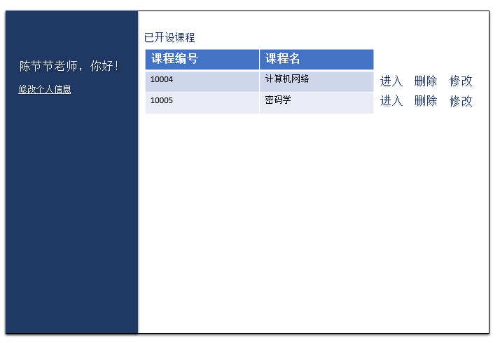

#界面设计 [返回](../README.md)

## 1.登录界面

## 2.管理员主页

## 3.添加用户

## 4.查询用户

## 5.修改用户信息

## 6.教师主页

## 7.课程管理

## 8.新建课程

## 9.实验管理

## 10.新建实验

## 11.修改实验信息

## 12.实验详情_老师页面

## 13.打分页面

## 14.学生列表页面

## 15.学生主页

## 16.选课

## 17.实验页面

## 18.实验详情_学生页面

## 19.成绩单

## 20.修改密码

## 21.修改github
